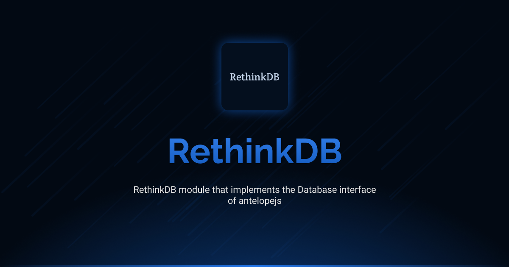

# @antelopejs/rethinkdb

[](https://www.npmjs.com/package/@antelopejs/rethinkdb)
[](https://opensource.org/licenses/Apache-2.0)
[](https://www.typescriptlang.org/)

A complete RethinkDB client module that implements the RethinkDB and Database interfaces for AntelopeJS.

## Installation

```bash
ajs project modules add @antelopejs/rethinkdb
```

## Interfaces

This module implements two key interfaces:

- **RethinkDB Interface**: Provides direct RethinkDB operations and connection management
- **Database Interface**: Offers a standardized database abstraction layer

Both interfaces can be used independently or together depending on your application's needs. The interfaces are installed separately to maintain modularity and minimize dependencies.


| Name          | Install command                         |            |
| ------------- | --------------------------------------- | ---------- |
| RethinkDB     | `ajs module imports add rethinkdb`      | [Documentation](https://github.com/AntelopeJS/interface-rethinkdb) |
| Database      | `ajs module imports add database`       | [Documentation](https://github.com/AntelopeJS/interface-database) |

## Overview

The AntelopeJS RethinkDB module provides functionality for interacting with RethinkDB:

- RethinkDB client connection management through the RethinkDB interface
- Common database operations through the Database interface

## Configuration

The RethinkDB module supports two types of connections, direct connection or connection pool, both using options from the `rethinkdb-ts` package:

### Direct Connection

```typescript
// Direct connection options (RConnectionOptions)
{
    host: "localhost",       // The host to connect to
    port: 28015,             // The port to connect on
    db: "test",              // The default database
    user: "admin",           // The user account to connect as
    password: "",            // The password for the user account
    timeout: 20,             // Timeout period in seconds for the connection to be opened
    ssl: false               // Use SSL for connection
}
```

### Connection Pool

```typescript
// Connection pool options (RPoolConnectionOptions)
{
    host: "localhost",       // The host to connect to
    port: 28015,             // The port to connect on
    db: "test",              // The default database
    user: "admin",           // The user account to connect as
    password: "",            // The password for the user account
    timeout: 20,             // Timeout period in seconds
    maxConnections: 10,      // Maximum number of connections in the pool
    bufferSize: 50,          // Buffer size for the pool
    maxBufferSize: 100,      // Maximum buffer size
    discovery: false,        // Enable server discovery
    servers: []              // Additional servers for connection
}
```

### Configuration Details

The module supports two connection methods:

- Direct connection using `r.connect()` with `RConnectionOptions`
- Connection pool using `r.connectPool()` with `RPoolConnectionOptions`

## License

This project is licensed under the Apache License 2.0 - see the [LICENSE](LICENSE) file for details.
