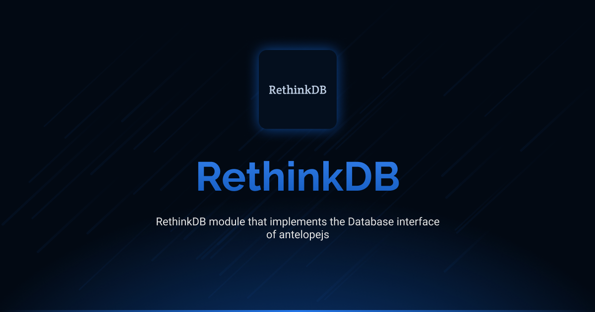

# @antelopejs/rethinkdb

<div align="center">
<a href="https://www.npmjs.com/package/@antelopejs/rethinkdb"></a>
<a href="./LICENSE"></a>
<a href="https://discord.gg/sjK28QHrA7"></a>
<a href="https://antelopejs.com/modules/rethinkdb"></a>
</div>

A complete RethinkDB client module that implements the RethinkDB and Database interfaces for AntelopeJS.

## Installation

```bash
ajs project modules add @antelopejs/rethinkdb
```

## Interfaces

This module implements two key interfaces:

- **RethinkDB Interface**: Provides direct RethinkDB operations and connection management
- **Database Interface**: Offers a standardized database abstraction layer

Both interfaces can be used independently or together depending on your application's needs. The interfaces are installed separately to maintain modularity and minimize dependencies.

| Name      | Install command                    |                                                                    |
| --------- | ---------------------------------- | ------------------------------------------------------------------ |
| RethinkDB | `ajs module imports add rethinkdb` | [Documentation](https://github.com/AntelopeJS/interface-rethinkdb) |
| Database  | `ajs module imports add database`  | [Documentation](https://github.com/AntelopeJS/interface-database)  |

## Overview

The AntelopeJS RethinkDB module provides functionality for interacting with RethinkDB:

- RethinkDB client connection management through the RethinkDB interface
- Common database operations through the Database interface

## Configuration

The RethinkDB module supports two types of connections, direct connection or connection pool, both using options from the `rethinkdb-ts` package:

### Direct Connection

```typescript
// Direct connection options (RConnectionOptions)
{
    host: "localhost",       // The host to connect to
    port: 28015,             // The port to connect on
    db: "test",              // The default database
    user: "admin",           // The user account to connect as
    password: "",            // The password for the user account
    timeout: 20,             // Timeout period in seconds for the connection to be opened
    ssl: false               // Use SSL for connection
}
```

### Connection Pool

```typescript
// Connection pool options (RPoolConnectionOptions)
{
    host: "localhost",       // The host to connect to
    port: 28015,             // The port to connect on
    db: "test",              // The default database
    user: "admin",           // The user account to connect as
    password: "",            // The password for the user account
    timeout: 20,             // Timeout period in seconds
    maxConnections: 10,      // Maximum number of connections in the pool
    bufferSize: 50,          // Buffer size for the pool
    maxBufferSize: 100,      // Maximum buffer size
    discovery: false,        // Enable server discovery
    servers: []              // Additional servers for connection
}
```

### Configuration Details

The module supports two connection methods:

- Direct connection using `r.connect()` with `RConnectionOptions`
- Connection pool using `r.connectPool()` with `RPoolConnectionOptions`

## Atomic single-record mutations

`table.atomicMutation(key, request).run()` checks one primary key, its instance,
and the requested condition inside a deterministic native RethinkDB `replace`
function. It never inserts a missing record or retries a submitted mutation.
`CROSS_INSTANCE` and selections are not supported.

Revision-based updates replace the supplied top-level fields, including complete
nested objects, and install `nextRevision` in the same write. Revision-based
deletes remove the matching record. The `{ kind: "missing" }` expected revision
matches an absent field on an existing record, not a stored `null` value. Callers
must use fresh revision tokens and must not reuse an identity across incarnations.

`deleteIfEqual` checks one scalar field, including a `Date`, before deleting the
record. It does not provide revision-based protection against a value changing
and later changing back. Retention callers must keep their cutoff fixed and
re-evaluate eligibility when they observe a different value.

The result is `applied`, `not-applied`, or `unknown`. Missing records, wrong
instances, and condition mismatches return `not-applied`. Lost acknowledgements,
indeterminate driver errors, untyped write-result errors, and malformed
acknowledgements return `unknown`; callers must reconcile them rather than infer
that no write occurred. Invalid requests and definite typed query-validation
errors throw. Ordinary insert/update/replace/delete operations reject write
errors, including duplicate primary keys; a multi-record write may have partially
succeeded before it reports an error.

This implementation requires the unpublished contract in
[interface-database PR #15](https://github.com/AntelopeJS/interface-database/pull/15).
The dependency range and lockfile remain unchanged until that contract is
published. A registry-only install cannot build this draft. Validation uses a
locally packed artifact of that PR, without a committed file dependency or an
invented package version.

## License

This project is licensed under the Apache License 2.0 - see the [LICENSE](LICENSE) file for details.
